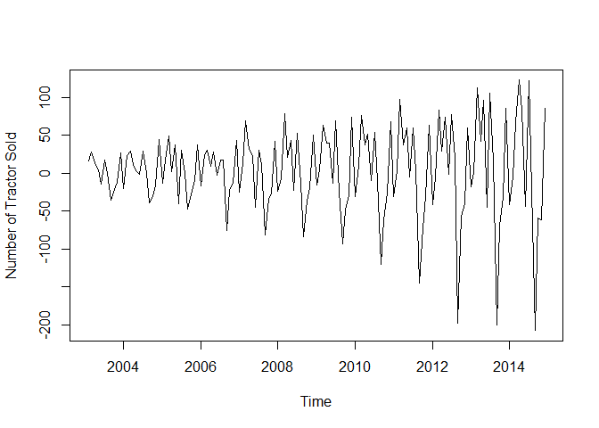
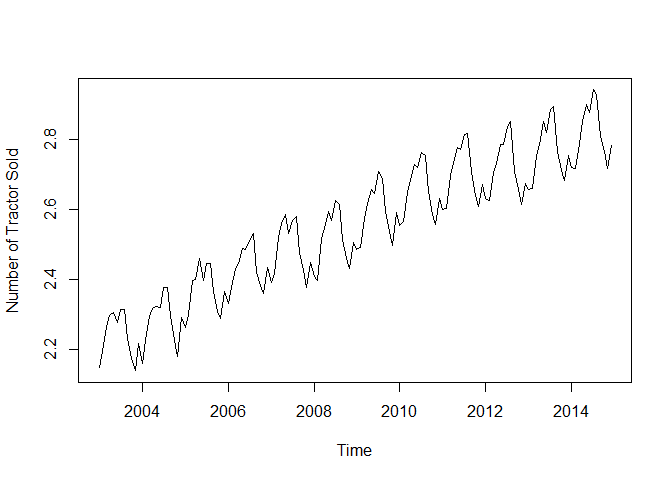
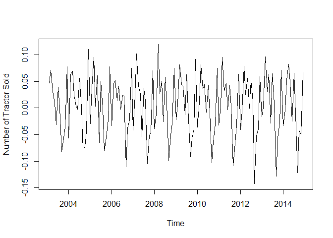
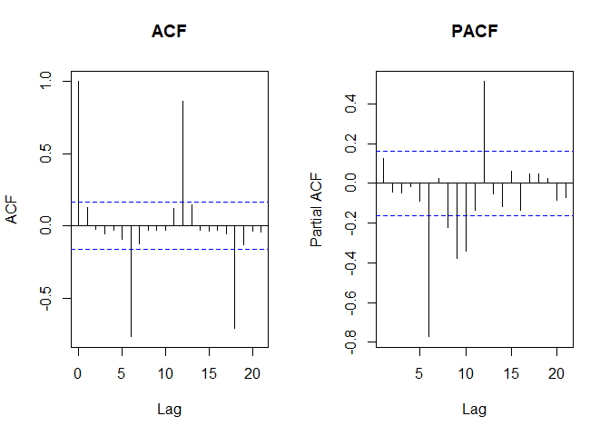

tractor\_arima
================
Christopher Chan
February 14, 2019

<http://ucanalytics.com/blogs/step-by-step-graphic-guide-to-forecasting-through-arima-modeling-in-r-manufacturing-case-study-example/>

``` r
library(here)
library(tidyverse)
library(tseries)
```

Read in data and get it into ts format.

``` r
here()
data <- read_csv('Tractor-Sales.csv')
```

    ## Parsed with column specification:
    ## cols(
    ##   `Month-Year` = col_character(),
    ##   `Number of Tractor Sold` = col_integer()
    ## )

``` r
data_ts <- ts(data[,2], start=c(2003, 1), frequency=12)
plot(data_ts)
```


dff() data to get a constant mean, eventually make it stationary.

``` r
plot(diff(data_ts))
```



log transforming to remove the variance.

``` r
plot(log10(data_ts))
```



log transforming and diff() to make it stationary. The result is much better.

``` r
st_data_ts <- diff(log10(data_ts))

plot(st_data_ts)
```



Validate stationarity with a ADF test. With a p-value &lt; 0.05 we can reject the null and conclude the results are stationary.

``` r
adf.test(st_data_ts, alternative='stationary')
```

    ## Warning in adf.test(st_data_ts, alternative = "stationary"): p-value
    ## smaller than printed p-value

    ## 
    ##  Augmented Dickey-Fuller Test
    ## 
    ## data:  st_data_ts
    ## Dickey-Fuller = -15.642, Lag order = 5, p-value = 0.01
    ## alternative hypothesis: stationary

Determine degrees of ARIMA from ACF and PACF plots

``` r
par(mfrow=c(1,2))
acf(st_data_ts)
pacf(st_data_ts)
```


