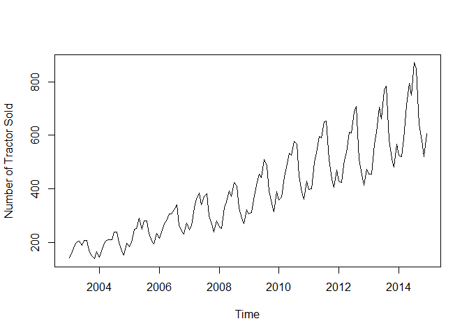

tractor\_arima
================
Christopher Chan
February 14, 2019

<http://ucanalytics.com/blogs/step-by-step-graphic-guide-to-forecasting-through-arima-modeling-in-r-manufacturing-case-study-example/>

``` r
library(here)
library(tidyverse)
library(tseries)
library(forecast)
```

Read in data and get it into ts format.

``` r
here()
data <- read_csv('Tractor-Sales.csv')
```

    ## Parsed with column specification:
    ## cols(
    ##   `Month-Year` = col_character(),
    ##   `Number of Tractor Sold` = col_integer()
    ## )

``` r
data_ts <- ts(data[,2], start=c(2003, 1), frequency=12)
plot(data_ts)
```



dff() data to get a constant mean, eventually make it stationary.

``` r
plot(diff(data_ts))
```


log transforming to remove the variance.

``` r
plot(log10(data_ts))
```


log transforming and diff() to make it stationary. The result is much better.

``` r
st_data_ts <- diff(log10(data_ts))

plot(st_data_ts)
```


Validate stationarity with a ADF test. With a p-value &lt; 0.05 we can reject the null and conclude the results are stationary.

``` r
adf.test(st_data_ts, alternative='stationary')
```

    ## Warning in adf.test(st_data_ts, alternative = "stationary"): p-value
    ## smaller than printed p-value

    ## 
    ##  Augmented Dickey-Fuller Test
    ## 
    ## data:  st_data_ts
    ## Dickey-Fuller = -15.642, Lag order = 5, p-value = 0.01
    ## alternative hypothesis: stationary

Determine degrees of ARIMA from ACF and PACF plots

``` r
par(mfrow=c(1,2))
acf(ts(st_data_ts), main='ACF')
pacf(ts(st_data_ts), main='PACF')
```

 Interpretation: Because of the significant values in both ACF and PACF plots an ARIMA mode is a good choice. The seasonal component exist because we see spikes at lag 12 on both graphs. AR(0), diff(1), MA(1)

``` r
arima_fit <- auto.arima(log10(data_ts), approximation=FALSE, trace=FALSE)

summary(arima_fit)
```

    ## Series: log10(data_ts) 
    ## ARIMA(0,1,1)(0,1,1)[12] 
    ## 
    ## Coefficients:
    ##           ma1     sma1
    ##       -0.4047  -0.5529
    ## s.e.   0.0885   0.0734
    ## 
    ## sigma^2 estimated as 0.0002571:  log likelihood=354.4
    ## AIC=-702.79   AICc=-702.6   BIC=-694.17
    ## 
    ## Training set error measures:
    ##                        ME       RMSE        MAE         MPE      MAPE
    ## Training set 0.0002410698 0.01517695 0.01135312 0.008335713 0.4462212
    ##                   MASE       ACF1
    ## Training set 0.2158968 0.01062604

Predict

``` r
pred <- predict(arima_fit, n.ahead=36)
# pred

plot(data_ts, type='l', xlim=c(2004, 2018), ylim=c(0, 1600))
lines(10^(pred$pred), col='blue')
lines(10^(pred$pred + 2*pred$se), col='orange')
lines(10^(pred$pred - 2*pred$se), col='orange')
```


