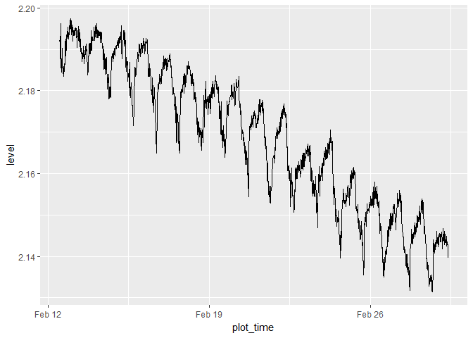
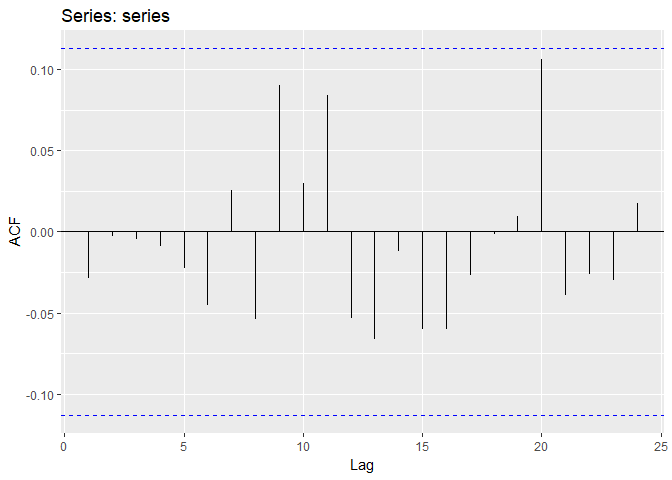
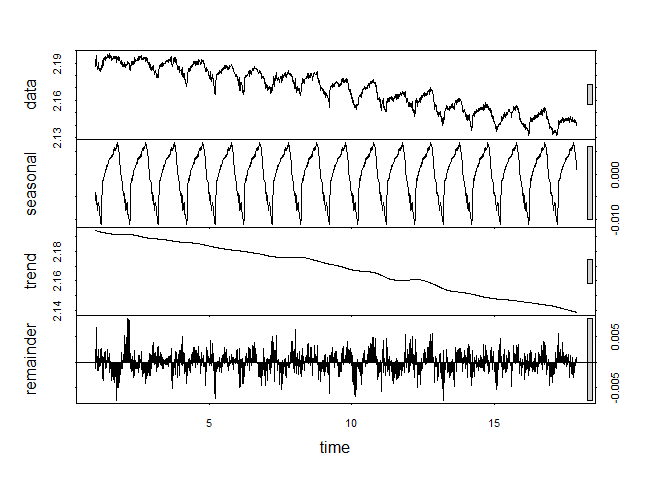
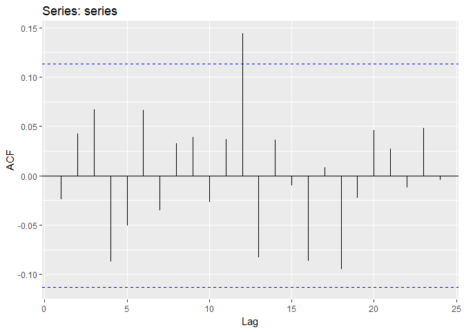
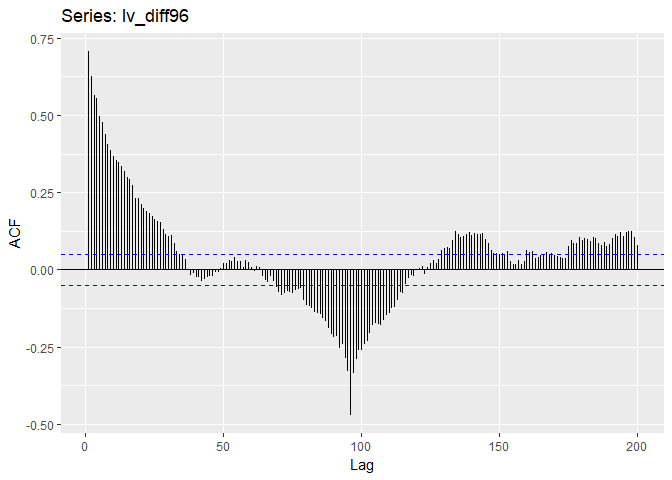
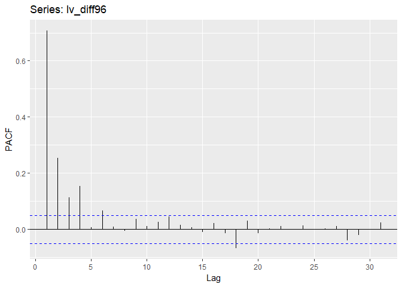
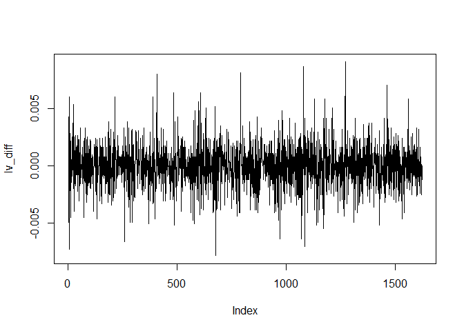
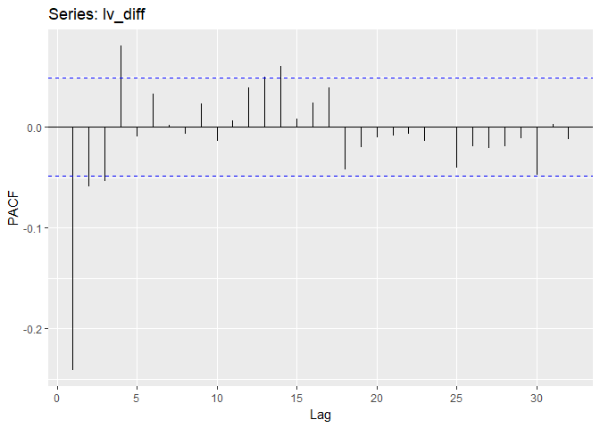
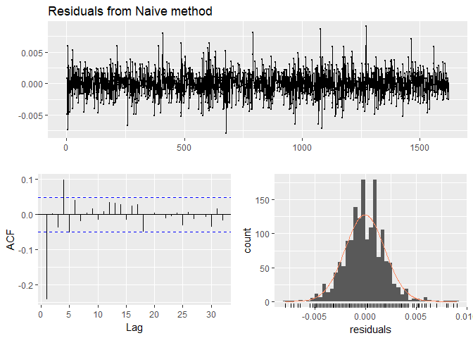
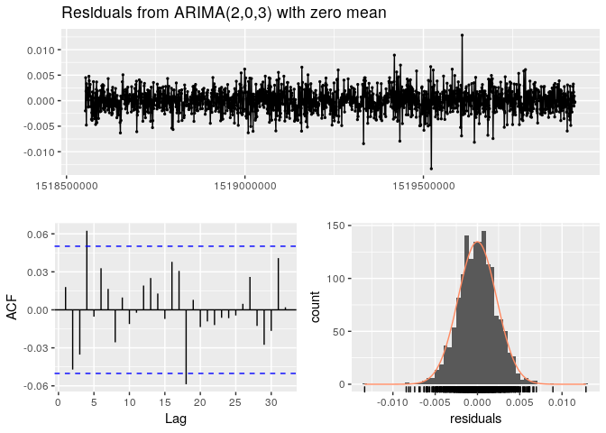

ts\_test
================
Christopher Chan
February 7, 2019

To do:

1.  Find out how to work with a non-stationary model
2.  Plot acf and pacf
    -   Determine the best model

### Links:

<https://rpubs.com/hrbrmstr/time-series-machinations>

<https://datascienceplus.com/time-series-analysis-using-arima-model-in-r/> <https://people.duke.edu/~rnau/411arim2.htm>

<https://www.r-bloggers.com/time-series-analysis-building-a-model-on-non-stationary-time-series/> <https://otexts.com/fpp2/stationarity.html>

<https://ourcodingclub.github.io/2017/04/26/time.html>

### Thoughts

-   Check for seasonality, diff(lv\_zoo$level, 96)
-   4\*24 = 96, the instances until the next repeat

``` r
library(tidyverse)
library(here)
library(chron)
library(zoo)
library(xts)
library(tseries)
library(forecast)
```

Reading in a logger dataset that I've been using for testing.

``` r
here()
lv <- read_csv('180301 Level Data.csv')

lv$date_time <- as.POSIXct(lv$date_time, format = '%m/%d/%y %H:%M')
```

Constructing the zoo class for our data. We are just starting out with water level.

``` r
lv_zoo <- zoo(lv$level_m, order.by = lv$date_time)

str(lv_zoo)
```

    ## 'zoo' series from 2018-02-12 12:00:00 to 2018-03-01 09:15:00
    ##   Data: num [1:1622] 2.19 2.19 2.19 2.19 2.2 ...
    ##   Index:  POSIXct[1:1622], format: "2018-02-12 12:00:00" "2018-02-12 12:15:00" ...

Checking to make sure all the data points are in the zoo class.

``` r
cat('Absolute difference in water level over the period of', as.character(start(lv_zoo)), 'and', as.character(end(lv_zoo)), 'in meters:', max(lv_zoo) - min(lv_zoo))
```

    ## Absolute difference in water level over the period of 2018-02-12 12:00:00 and 2018-03-01 09:15:00 in meters: 0.06599439

Graphing the water level across time we see that the data is not stationary. A quick look at the graph and we can conclude that the mean decreases over time. Without further testing it is too hard to tell if the variance and covariance vary over time, but I believe they are relatively constant. These statitistical facts fit the ecological realities of Devereux Slough. Because of the very short rainy season, roughly \[X\] months, in Santa Barbara we would expect to see water level decrease in late winter.

``` r
lv_zoo <- data.frame(lv_zoo)

lv_zoo <- lv_zoo %>%
    rename(level = lv_zoo) %>%
    mutate(plot_time = as.POSIXct(rownames(lv_zoo), format = "%Y-%m-%d %H:%M:%S"))
lv_zoo <- lv_zoo %>% select(plot_time, level)


head(lv_zoo)
```

    ##             plot_time    level
    ## 1 2018-02-12 12:00:00 2.191814
    ## 2 2018-02-12 12:15:00 2.192614
    ## 3 2018-02-12 12:30:00 2.187681
    ## 4 2018-02-12 12:45:00 2.190214
    ## 5 2018-02-12 13:00:00 2.196213
    ## 6 2018-02-12 13:15:00 2.188881

``` r
ggplot(lv_zoo, aes(plot_time, level)) +
    geom_line() +
    xlab('Date') +
    ylab('Level (m)') + 
    ggtitle('Water level (m) over time')
```



``` r
ggplot(lv_zoo, aes(plot_time, level)) +
    geom_line() +
    geom_smooth(method = 'loess', se = FALSE) +
    xlab('Date') +
    ylab('Level (m)') + 
    ggtitle('Water level (m) over time')
```



ACF before differencing. There is a obvious pattern to our data and most of the lags are above the significance level. Notice that cycles repeat roughly every 100 observations.

``` r
ggAcf(lv$level_m, lag.max=200)
```



diff for the seasonality. I think this shows that there are major seasonal

``` r
lv_diff96 <- diff(lv_zoo$level, 96)

plot(lv_diff96, type='l')
```



``` r
ggAcf(lv_diff96, lag.max = 200)
```



``` r
ggPacf(lv_diff96)
```



Plotting the diff(). The ACF, and PACF, look like random noise with some memory of previous events. There also exist some I'm using the standard R plot because ggplot requires all the x to have a corresponding y. Because diff() preforms the operation *y*<sub>*t*</sub> − *y*<sub>*t* − 1</sub> the first observation will be 'missing', because *y*<sub>0</sub> does not exist.

Our model is now the residuals(?)

``` r
lv_diff <- diff(lv_zoo$level) 
plot(lv_diff, type='l')
```



``` r
ggAcf(lv_diff, lag.max = 200)
```


``` r
ggPacf(lv_diff)
```



``` r
gghistogram(lv_diff)
```


Running a Lijung-Box test to quantifiable determine if the ACF of lv\_diff is non-zero. Because the *H*<sub>0</sub> of the Box-Ljung test is that the data is independently distributed, rejecting the *H*<sub>0</sub> means that serial correlation exist in the data. Since the p-value is less than standrd of 0.05, in this case it is less than 2.2e-16, we reject the *H*<sub>0</sub> and conclude the data has some serial correlation.

``` r
Box.test(lv_diff, lag=10, type='Ljung-Box')
```

    ## 
    ##  Box-Ljung test
    ## 
    ## data:  lv_diff
    ## X-squared = 120.95, df = 10, p-value < 2.2e-16

This is the same as above. Naive is a ARIMA(0,1,0)

``` r
checkresiduals(naive(lv_zoo$level))
```



    ## 
    ##  Ljung-Box test
    ## 
    ## data:  Residuals from Naive method
    ## Q* = 120.95, df = 10, p-value < 2.2e-16
    ## 
    ## Model df: 0.   Total lags used: 10

ggAcf(coredata(lv\_zoo)) ggPacf(lv\_zoo)

The ACF

acf(coredata(lv\_zoo)) pacf(coredata(lv\_zoo))

``` r
ggplot(lv, aes(date_time, level_m)) +
    geom_line()
```



The classical additive decomposition:
*X*<sub>*t*</sub> = *μ*<sub>*t*</sub> + *s*<sub>*t*</sub> + *Z*<sub>*t*</sub>

Where *μ*<sub>*t*</sub> is the trend component, *s*<sub>*t*</sub> is the seasonal component, and *Z*<sub>*t*</sub> is the white noise. Goal is to make *Z*<sub>*t*</sub> stationary random so that we can

Python links:

-   <https://machinelearningmastery.com/remove-trends-seasonality-difference-transform-python/>
-   <https://www.analyticsvidhya.com/blog/2018/09/non-stationary-time-series-python/>
