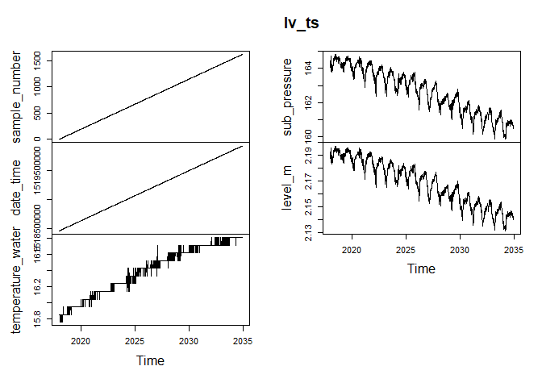

ts\_test
================
Christopher Chan
February 7, 2019

<https://rpubs.com/hrbrmstr/time-series-machinations>

``` r
library(tidyverse)
library(here)
library(chron)
library(zoo)
library(xts)
```

Reading in a logger dataset that I've been using for testing.

``` r
here()

lv <- read_csv('180301 Level Data.csv')
head(lv)
```

converts logger date and time into a readable format for R. Additional reading on this topic can be found here: <http://biostat.mc.vanderbilt.edu/wiki/pub/Main/ColeBeck/datestimes.pdf>

``` r
lv$date_time <- as.POSIXct(lv$date_time, format = "%m/%d/%y %H:%M")

head(lv)
```

    ## # A tibble: 6 x 5
    ##   sample_number date_time           temperature_water sub_pressure level_m
    ##           <int> <dttm>                          <dbl>        <dbl>   <dbl>
    ## 1             1 2018-02-12 12:00:00              15.9         164.    2.19
    ## 2             2 2018-02-12 12:15:00              15.9         164.    2.19
    ## 3             3 2018-02-12 12:30:00              15.9         164.    2.19
    ## 4             4 2018-02-12 12:45:00              15.9         164.    2.19
    ## 5             5 2018-02-12 13:00:00              15.9         165.    2.20
    ## 6             6 2018-02-12 13:15:00              15.9         164.    2.19

``` r
lv_ts <- ts(lv, start=c(2018, 02, 12, 12, 15), frequency=96)


plot(lv_ts)
```


