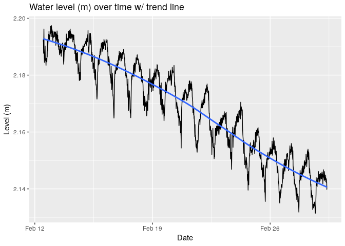
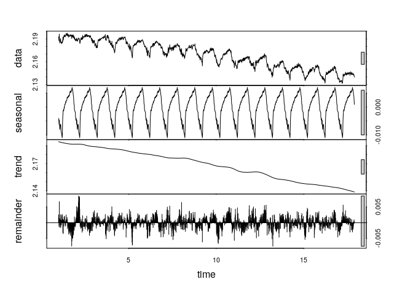
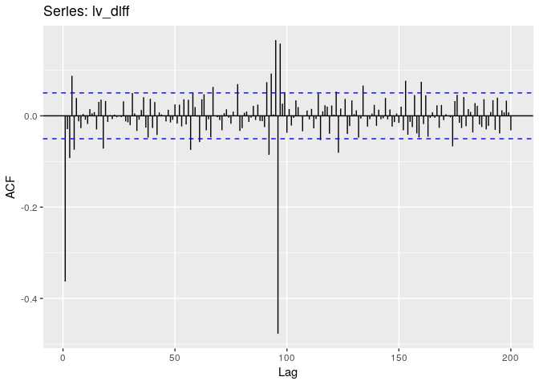

ts\_test
================
Christopher Chan
February 7, 2019

<https://otexts.com/fpp2/arima-r.html> <https://stats.stackexchange.com/questions/286505/how-do-i-tell-that-my-time-series-is-stationary-or-not> <https://stats.stackexchange.com/questions/137967/is-my-time-series-stationary>

Seasonality: <https://stats.stackexchange.com/questions/245729/forecast-time-series-with-two-seasonal-patterns>

To do: 1. validate model \* why do the predictions not make sense 2. finish write up

Take the seasonal diff and then diff

### Links:

<https://rpubs.com/hrbrmstr/time-series-machinations>

<https://datascienceplus.com/time-series-analysis-using-arima-model-in-r/> <https://people.duke.edu/~rnau/411arim2.htm>

<https://www.r-bloggers.com/time-series-analysis-building-a-model-on-non-stationary-time-series/> <https://otexts.com/fpp2/stationarity.html>

<https://ourcodingclub.github.io/2017/04/26/time.html>

``` r
library(tidyverse)
library(gridExtra)
library(here)
library(zoo)
library(tseries)
library(forecast)
```

Reading in a logger dataset that I've been using for testing.

``` r
here()
lv <- read_csv('180301 Level Data copy.csv')

lv$date_time <- as.POSIXct(lv$date_time, format = '%m/%d/%y %H:%M')
```

Constructing the zoo class for our data. We are just starting out with water level.

``` r
lv_zoo <- zoo(lv$level_m, order.by = lv$date_time)

str(lv_zoo)
```

    ## 'zoo' series from 2018-02-12 12:00:00 to 2018-03-01 09:15:00
    ##   Data: num [1:1622] 2.19 2.19 2.19 2.19 2.2 ...
    ##   Index:  POSIXct[1:1622], format: "2018-02-12 12:00:00" "2018-02-12 12:15:00" ...

Checking to make sure all the data points are in the zoo class.

``` r
lv_df <- lv[c(2,5)]

cat('Absolute difference in water level over the period of', as.character(start(lv_zoo)), 'and', as.character(end(lv_zoo)), 'in meters:', max(lv_df$level_m) - min(lv_df$level_m))
```

    ## Absolute difference in water level over the period of 2018-02-12 12:00:00 and 2018-03-01 09:15:00 in meters: 0.06599439

Graphing the water level across time we gather a number of important insights into our data. The first is that the time series is not stationary. A quick look at the graph and we can conclude that the mean decreases over time. Without further testing it is too hard to tell if the variance and covariance vary over time, but I believe they are relatively constant. If the variance is constant than we can perform additive decomposition, this is where the seasonal variation is constant across time. A additive model is describe as: *T**i**m**e**s**e**r**i**e**s* = *S**e**a**s**o**n**a**l* + *T**r**e**n**d* + *R**a**n**d**o**m*

Second, it appears we have some seasonality, on a daily basis. This should be removed in order to get a accurate depiction of the trend of the series. These statitistical facts fit the ecological realities of Devereux Slough. Because of the very short rainy season, roughly 3 months, in Santa Barbara we would expect to see water level decrease in late winter.

``` r
ggplot(lv_df, aes(date_time, level_m)) +
    geom_line() +
    xlab('Date') +
    ylab('Level (m)') + 
    ggtitle('Water level (m) over time')
```


The same time series with a smoothing function to get the general trend.

``` r
ggplot(lv_df, aes(date_time, level_m)) +
    geom_line() +
    geom_smooth(method = 'loess', se = FALSE) +
    xlab('Date') +
    ylab('Level (m)') + 
    ggtitle('Water level (m) over time w/ trend line')
```



TO DO: Write more \* What the graph shows \* Analysis

This checks the seasonality and trend of the data. The seasonality seems to be daily and the trend is a gradual downward slope.

``` r
ts <- ts(lv_df$level_m, frequency = 96)

decomp_ts <- stl(ts, s.window='period')
plot(decomp_ts)
```



ACF and PACF before differencing. There is a obvious pattern to our data and most of the ACF lags are above the significance level. This indicates we must difference the data, the question is by how much.

``` r
grid.arrange(ggAcf(lv_zoo), ggPacf(lv_zoo), nrow=2)
```


A seaonally difference taken. There is still a obivous trend and the resiudals have large cycles around 0.

``` r
lv_zoo %>%
    diff(lag=96) %>%
    ggtsdisplay(xlab='Sample',
                main='Seasonal differenced water level')
```


Our decomposed plots indicate that we have seasonality on a daily basis, so we'll take a difference with a lag of 96. This is the water level at the same time the following preceding day. However, simply differencing by season still shows major trends in the ACF function so we'll take the lag-1 difference as well. This will remove the trends from our time series and produces the plots below which show few significant values and residuals with no distinct pattern. With differencing we've been able to remove seasonality and trend from our time series and can procede to make our model.

``` r
lv_diff <- lv_zoo %>%
    diff(lag=96) %>%
    diff()

ggtsdisplay(lv_diff, xlab='Sample',
                main='Seasonally differenced diff(1) water level')
```


A finer breakdown of the seasonally differenced level data.

``` r
plot(lv_diff, type='l')
```


``` r
ggAcf(lv_diff, lag.max = 200)
```



``` r
ggPacf(lv_diff)
```


To make sure our data is stationary we'll run a augmented Dickey-Fuller test (ADF). ADF comes to a incorrect conclusion about our raw data. Visually the data is non-stationary, there is a obvious downward trend. We'll run a kpss test

i'm creating a model

``` r
model_diff <- auto.arima(lv_diff, approximation=FALSE, trace=FALSE)
summary(model_diff)
```

    ## Series: lv_diff 
    ## ARIMA(2,0,3) with zero mean 
    ## 
    ## Coefficients:
    ##           ar1     ar2      ma1      ma2     ma3
    ##       -0.0745  0.6757  -0.4544  -0.7487  0.2779
    ## s.e.   0.4889  0.5419   0.5585   0.2502  0.4536
    ## 
    ## sigma^2 estimated as 5.185e-06:  log likelihood=7117.63
    ## AIC=-14223.27   AICc=-14223.21   BIC=-14191.29
    ## 
    ## Training set error measures:
    ##                         ME        RMSE         MAE MPE MAPE      MASE
    ## Training set -1.219233e-05 0.002273418 0.001767337 NaN  Inf 0.8967587
    ##                    ACF1
    ## Training set 0.01797062

``` r
checkresiduals(model_diff)
```


    ## 
    ##  Ljung-Box test
    ## 
    ## data:  Residuals from ARIMA(2,0,3) with zero mean
    ## Q* = 15.226, df = 5, p-value = 0.009438
    ## 
    ## Model df: 5.   Total lags used: 10

``` r
autoplot(forecast(model_diff))
```


Creation of a model from

``` r
lv_zoo %>%
    Arima(order=c(2,1,3), seasonal=c(0,1,0), lambda=0) %>%
    forecast(h=100) %>%
    autoplot()
```


Running a Lijung-Box test to quantifiable determine if the ACF of lv\_diff is non-zero. Because the *H*<sub>0</sub> of the Box-Ljung test is that the data is independently distributed, rejecting the *H*<sub>0</sub> means that serial correlation exist in the data. Since the p-value is less than standrd of 0.05, in this case it is less than 2.2e-16, we reject the *H*<sub>0</sub> and conclude the data has some serial correlation.

``` r
Box.test(lv_diff, lag=10, type='Ljung-Box')
```

    ## 
    ##  Box-Ljung test
    ## 
    ## data:  lv_diff
    ## X-squared = 239.56, df = 10, p-value < 2.2e-16

The classical additive decomposition:
*X*<sub>*t*</sub> = *μ*<sub>*t*</sub> + *s*<sub>*t*</sub> + *Z*<sub>*t*</sub>

Where *μ*<sub>*t*</sub> is the trend component, *s*<sub>*t*</sub> is the seasonal component, and *Z*<sub>*t*</sub> is the white noise. Goal is to make *Z*<sub>*t*</sub> stationary random so that we can

Python links:

-   <https://machinelearningmastery.com/remove-trends-seasonality-difference-transform-python/>
-   <https://www.analyticsvidhya.com/blog/2018/09/non-stationary-time-series-python/>

lv\_df &lt;- lv\_df %&gt;% mutate(plot\_time = as.POSIXct(rownames(lv\_df), format = "%Y-%m-%d %H:%M:%S")) lv\_df &lt;- lv\_df %&gt;% select(plot\_time, level)

head(lv\_df)
