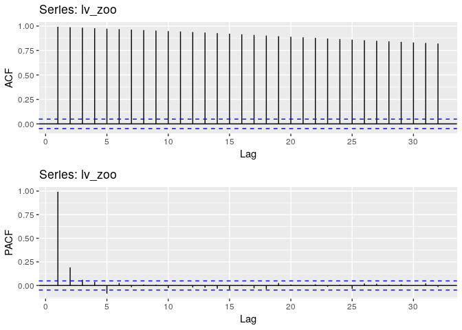
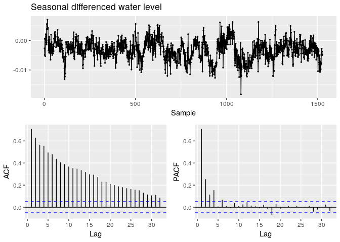

ts\_test
================
Christopher Chan
February 7, 2019

To do:

1.  Find out how to work with a non-stationary model
2.  Plot acf and pacf
    -   Determine the best model

<https://rpubs.com/hrbrmstr/time-series-machinations>

<https://datascienceplus.com/time-series-analysis-using-arima-model-in-r/> <https://people.duke.edu/~rnau/411arim2.htm>

<https://www.r-bloggers.com/time-series-analysis-building-a-model-on-non-stationary-time-series/> <https://otexts.com/fpp2/stationarity.html>

<https://ourcodingclub.github.io/2017/04/26/time.html>

``` r
library(tidyverse)
library(here)
library(chron)
library(zoo)
library(xts)
library(tseries)
library(forecast)
```

Reading in a logger dataset that I've been using for testing.

``` r
here()
lv <- read_csv('180301 Level Data.csv')

lv$date_time <- as.POSIXct(lv$date_time, format = '%m/%d/%y %H:%M')
```

Constructing the zoo class for our data. We are just starting out with water level.

``` r
lv_zoo <- zoo(lv$level_m, order.by = lv$date_time)

str(lv_zoo)
```

    ## 'zoo' series from 2018-02-12 12:00:00 to 2018-03-01 09:15:00
    ##   Data: num [1:1622] 2.19 2.19 2.19 2.19 2.2 ...
    ##   Index:  POSIXct[1:1622], format: "2018-02-12 12:00:00" "2018-02-12 12:15:00" ...

Checking to make sure all the data points are in the zoo class.

``` r
cat('Absolute difference in water level over the period of', as.character(start(lv_zoo)), 'and', as.character(end(lv_zoo)), 'in meters:', max(lv_zoo) - min(lv_zoo))
```

    ## Absolute difference in water level over the period of 2018-02-12 12:00:00 and 2018-03-01 09:15:00 in meters: 0.06599439

Graphing the water level across time we see that the data is not stationary. A quick look at the graph and we can conclude that the mean decreases over time. Without further testing it is too hard to tell if the variance and covariance vary over time, but I believe they are relatively constant. These statitistical facts fit the ecological realities of Devereux Slough. Because of the very short rainy season, roughly \[X\] months, in Santa Barbara we would expect to see water level decrease in late winter.

``` r
lv_zoo <- data.frame(lv_zoo)

lv_zoo <- lv_zoo %>%
    rename(level = lv_zoo) %>%
    mutate(plot_time = as.POSIXct(rownames(lv_zoo), format = "%Y-%m-%d %H:%M:%S"))
```

    ## Warning: package 'bindrcpp' was built under R version 3.4.4

``` r
lv_zoo <- lv_zoo %>% select(plot_time, level)


head(lv_zoo)
```

    ##             plot_time    level
    ## 1 2018-02-12 12:00:00 2.191814
    ## 2 2018-02-12 12:15:00 2.192614
    ## 3 2018-02-12 12:30:00 2.187681
    ## 4 2018-02-12 12:45:00 2.190214
    ## 5 2018-02-12 13:00:00 2.196213
    ## 6 2018-02-12 13:15:00 2.188881

``` r
ggplot(lv_zoo, aes(plot_time, level)) +
    geom_line() +
    xlab('Date') +
    ylab('Level (m)') + 
    ggtitle('Water level (m) over time')
```


``` r
ggplot(lv_zoo, aes(plot_time, level)) +
    geom_line() +
    geom_smooth(method = 'loess', se = FALSE) +
    xlab('Date') +
    ylab('Level (m)') + 
    ggtitle('Water level (m) over time')
```


Plotting the diff(). I'm using the standard R plot because ggplot requires all the x to have a corresponding y. Because diff() preforms the operation *y*<sub>*t*</sub> − *y*<sub>*t* − 1</sub> the first observation will be 'missing', because *y*<sub>0</sub> does not exist.

``` r
plot(diff(lv_zoo$level), type='l')
```


``` r
ggAcf(diff(lv_zoo$level), lag.max = 200)
```


``` r
ggPacf(diff(lv_zoo$level))
```


Cycle repeats roughly every 100 observations.

``` r
series <- rnorm(300)
ggAcf(series)
```



``` r
ggAcf(lv$level_m, lag.max=200)
```


ggAcf(coredata(lv\_zoo)) ggPacf(lv\_zoo)

The ACF

acf(coredata(lv\_zoo)) pacf(coredata(lv\_zoo))

``` r
ggplot(lv, aes(date_time, level_m)) +
    geom_line()
```



Python links:

-   <https://machinelearningmastery.com/remove-trends-seasonality-difference-transform-python/>
-   <https://www.analyticsvidhya.com/blog/2018/09/non-stationary-time-series-python/>
