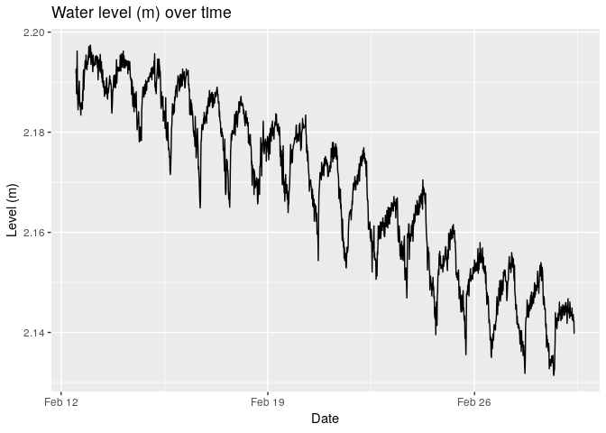
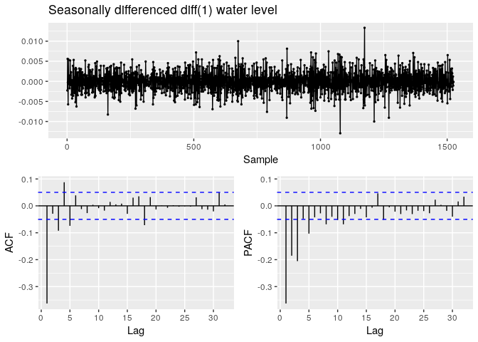
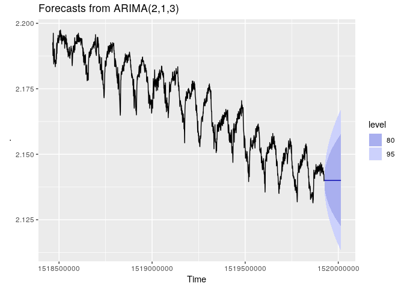

ts\_test
================
Christopher Chan
February 7, 2019

<https://otexts.com/fpp2/arima-r.html> <https://stats.stackexchange.com/questions/286505/how-do-i-tell-that-my-time-series-is-stationary-or-not> <https://stats.stackexchange.com/questions/137967/is-my-time-series-stationary>

Seasonality: <https://stats.stackexchange.com/questions/245729/forecast-time-series-with-two-seasonal-patterns> <https://stats.stackexchange.com/questions/245729/forecast-time-series-with-two-seasonal-patterns>

To do: 1. Test seaonality, it has to be daily (<https://anomaly.io/detect-seasonality-using-fourier-transform-r/>) 2. remove seasonality from time series 3. validate model 4. finish write up

### Links:

<https://rpubs.com/hrbrmstr/time-series-machinations>

<https://datascienceplus.com/time-series-analysis-using-arima-model-in-r/> <https://people.duke.edu/~rnau/411arim2.htm>

<https://www.r-bloggers.com/time-series-analysis-building-a-model-on-non-stationary-time-series/> <https://otexts.com/fpp2/stationarity.html>

<https://ourcodingclub.github.io/2017/04/26/time.html>

### Thoughts

-   Check for seasonality, diff(lv\_zoo$level, 96)
-   4\*24 = 96, the instances until the next repeat

``` r
library(tidyverse)
library(here)
library(zoo)
library(tseries)
library(forecast)
```

Reading in a logger dataset that I've been using for testing.

``` r
here()
lv <- read_csv('180301 Level Data copy.csv')

lv$date_time <- as.POSIXct(lv$date_time, format = '%m/%d/%y %H:%M')
```

Constructing the zoo class for our data. We are just starting out with water level.

``` r
lv_zoo <- zoo(lv$level_m, order.by = lv$date_time)

str(lv_zoo)
```

    ## 'zoo' series from 2018-02-12 12:00:00 to 2018-03-01 09:15:00
    ##   Data: num [1:1622] 2.19 2.19 2.19 2.19 2.2 ...
    ##   Index:  POSIXct[1:1622], format: "2018-02-12 12:00:00" "2018-02-12 12:15:00" ...

Checking to make sure all the data points are in the zoo class.

``` r
cat('Absolute difference in water level over the period of', as.character(start(lv_zoo)), 'and', as.character(end(lv_zoo)), 'in meters:', max(lv_zoo) - min(lv_zoo))
```

    ## Absolute difference in water level over the period of 2018-02-12 12:00:00 and 2018-03-01 09:15:00 in meters: 0.06599439

Graphing the water level across time we gather a number of important insights into our data. The first is that the time series is not stationary. A quick look at the graph and we can conclude that the mean decreases over time. Without further testing it is too hard to tell if the variance and covariance vary over time, but I believe they are relatively constant. If the variance is constant than we can perform additive decomposition, this is where the seasonal variation is constant across time. A additive model is describe as: *T**i**m**e**s**e**r**i**e**s* = *S**e**a**s**o**n**a**l* + *T**r**e**n**d* + *R**a**n**d**o**m*

Second, it appears we have some seasonality, on a daily basis. This should be removed in order to get a accurate depiction of the trend of the series. These statitistical facts fit the ecological realities of Devereux Slough. Because of the very short rainy season, roughly 3 months, in Santa Barbara we would expect to see water level decrease in late winter.

``` r
df_lv_zoo <- data.frame(lv_zoo)

df_lv_zoo <- df_lv_zoo %>%
    rename(level = lv_zoo) %>%
    mutate(plot_time = as.POSIXct(rownames(df_lv_zoo), format = "%Y-%m-%d %H:%M:%S"))
df_lv_zoo <- df_lv_zoo %>% select(plot_time, level)


head(df_lv_zoo)
```

    ##             plot_time    level
    ## 1 2018-02-12 12:00:00 2.191814
    ## 2 2018-02-12 12:15:00 2.192614
    ## 3 2018-02-12 12:30:00 2.187681
    ## 4 2018-02-12 12:45:00 2.190214
    ## 5 2018-02-12 13:00:00 2.196213
    ## 6 2018-02-12 13:15:00 2.188881

``` r
ggplot(df_lv_zoo, aes(plot_time, level)) +
    geom_line() +
    xlab('Date') +
    ylab('Level (m)') + 
    ggtitle('Water level (m) over time')
```



The same time series with a smoothing function to get the general trend.

``` r
ggplot(df_lv_zoo, aes(plot_time, level)) +
    geom_line() +
    geom_smooth(method = 'loess', se = FALSE) +
    xlab('Date') +
    ylab('Level (m)') + 
    ggtitle('Water level (m) over time w/ trend line')
```


<https://robjhyndman.com/hyndsight/seasonal-periods/> This checks the seasonality and trend of the data. The seasonality seems to be daily and the trend is a gradual downward slope.

``` r
ts <- ts(df_lv_zoo$level, frequency = 96)

decomp_ts <- stl(ts, s.window='period')
plot(decomp_ts)
```


ACF before differencing. There is a obvious pattern to our data and most of the lags are above the significance level.

``` r
ggAcf(lv$level_m, lag.masx=100)
```


diff for the seasonality. I think this shows that there are major seasonal

``` r
lv_diff96 <- diff(df_lv_zoo$level, 96)

plot(lv_diff96, type='l')
```


``` r
ggAcf(lv_diff96, lag.max = 200)
```


``` r
ggPacf(lv_diff96)
```


Because there is a trend, a seasonal naive model will not work.

``` r
plot(diff(lv_diff96), type='l')
```



``` r
ggAcf(diff(lv_diff96), lag.max=200)
```


Plotting the diff(). The ACF, and PACF, look like random noise with some memory of previous events. There also exist some I'm using the standard R plot because ggplot requires all the x to have a corresponding y. Because diff() preforms the operation *y*<sub>*t*</sub> − *y*<sub>*t* − 1</sub> the first observation will be 'missing', because *y*<sub>0</sub> does not exist.

Our model is now the residuals(?)

``` r
lv_diff <- diff(df_lv_zoo$level) 
plot(lv_diff, type='l')
```


``` r
ggAcf(lv_diff)
```


``` r
ggPacf(lv_diff)
```


To make sure our data is stationary we'll run a augmented Dickey-Fuller test (ADF). ADF comes to a incorrect conclusion about our raw data. Visually the data is non-stationary, there is a obvious downward trend. We'll run a kpss test

``` r
raw <- adf.test(lv_zoo, alternative='stationary')
```

    ## Warning in adf.test(lv_zoo, alternative = "stationary"): p-value smaller
    ## than printed p-value

``` r
raw
```

    ## 
    ##  Augmented Dickey-Fuller Test
    ## 
    ## data:  lv_zoo
    ## Dickey-Fuller = -6.1251, Lag order = 11, p-value = 0.01
    ## alternative hypothesis: stationary

``` r
adf.test(lv_diff, alternative='stationary')
```

    ## Warning in adf.test(lv_diff, alternative = "stationary"): p-value smaller
    ## than printed p-value

    ## 
    ##  Augmented Dickey-Fuller Test
    ## 
    ## data:  lv_diff
    ## Dickey-Fuller = -10.96, Lag order = 11, p-value = 0.01
    ## alternative hypothesis: stationary

``` r
adj <- adf.test(lv_diff96, alternative='stationary')
```

    ## Warning in adf.test(lv_diff96, alternative = "stationary"): p-value smaller
    ## than printed p-value

``` r
adj
```

    ## 
    ##  Augmented Dickey-Fuller Test
    ## 
    ## data:  lv_diff96
    ## Dickey-Fuller = -5.9272, Lag order = 11, p-value = 0.01
    ## alternative hypothesis: stationary

``` r
kpss.test(lv_zoo)
```

    ## Warning in kpss.test(lv_zoo): p-value smaller than printed p-value

    ## 
    ##  KPSS Test for Level Stationarity
    ## 
    ## data:  lv_zoo
    ## KPSS Level = 16.525, Truncation lag parameter = 8, p-value = 0.01

``` r
kpss.test(lv_diff)
```

    ## Warning in kpss.test(lv_diff): p-value greater than printed p-value

    ## 
    ##  KPSS Test for Level Stationarity
    ## 
    ## data:  lv_diff
    ## KPSS Level = 0.011013, Truncation lag parameter = 8, p-value = 0.1

``` r
kpss.test(lv_diff96)
```

    ## Warning in kpss.test(lv_diff96): p-value smaller than printed p-value

    ## 
    ##  KPSS Test for Level Stationarity
    ## 
    ## data:  lv_diff96
    ## KPSS Level = 0.8298, Truncation lag parameter = 7, p-value = 0.01

``` r
gghistogram(lv_diff)
```



``` r
gghistogram(lv_diff96)
```


Running a Lijung-Box test to quantifiable determine if the ACF of lv\_diff is non-zero. Because the *H*<sub>0</sub> of the Box-Ljung test is that the data is independently distributed, rejecting the *H*<sub>0</sub> means that serial correlation exist in the data. Since the p-value is less than standrd of 0.05, in this case it is less than 2.2e-16, we reject the *H*<sub>0</sub> and conclude the data has some serial correlation.

``` r
Box.test(lv_diff, lag=10, type='Ljung-Box')
```

    ## 
    ##  Box-Ljung test
    ## 
    ## data:  lv_diff
    ## X-squared = 120.95, df = 10, p-value < 2.2e-16

This is the same as above. Naive is a ARIMA(0,1,0)

``` r
# checkresiduals(naive(lv_zoo$level))
```

i'm creating a model

``` r
model_diff <- auto.arima(lv_diff, approximation=FALSE, trace=FALSE)
summary(model_diff)
```

    ## Series: lv_diff 
    ## ARIMA(1,0,4) with zero mean 
    ## 
    ## Coefficients:
    ##           ar1     ma1      ma2      ma3     ma4
    ##       -0.5367  0.2842  -0.1419  -0.0168  0.0915
    ## s.e.   0.1558  0.1560   0.0453   0.0255  0.0268
    ## 
    ## sigma^2 estimated as 3.537e-06:  log likelihood=7876.02
    ## AIC=-15740.04   AICc=-15739.99   BIC=-15707.69
    ## 
    ## Training set error measures:
    ##                         ME        RMSE         MAE MPE MAPE      MASE
    ## Training set -4.058469e-05 0.001877689 0.001421595 NaN  Inf 0.6033058
    ##                      ACF1
    ## Training set -0.000653382

``` r
checkresiduals(model_diff)
```


    ## 
    ##  Ljung-Box test
    ## 
    ## data:  Residuals from ARIMA(1,0,4) with zero mean
    ## Q* = 1.1414, df = 5, p-value = 0.9504
    ## 
    ## Model df: 5.   Total lags used: 10

``` r
autoplot(forecast(model_diff))
```


``` r
own_model <- Arima(lv_zoo, order=c(1,1,4))
checkresiduals(own_model)
```


    ## 
    ##  Ljung-Box test
    ## 
    ## data:  Residuals from ARIMA(1,1,4)
    ## Q* = 1.0066, df = 5, p-value = 0.962
    ## 
    ## Model df: 5.   Total lags used: 10

``` r
autoplot(forecast(own_model, h=1000))
```


``` r
ggplot(lv, aes(date_time, level_m)) +
    geom_line()
```


The classical additive decomposition:
*X*<sub>*t*</sub> = *μ*<sub>*t*</sub> + *s*<sub>*t*</sub> + *Z*<sub>*t*</sub>

Where *μ*<sub>*t*</sub> is the trend component, *s*<sub>*t*</sub> is the seasonal component, and *Z*<sub>*t*</sub> is the white noise. Goal is to make *Z*<sub>*t*</sub> stationary random so that we can

Python links:

-   <https://machinelearningmastery.com/remove-trends-seasonality-difference-transform-python/>
-   <https://www.analyticsvidhya.com/blog/2018/09/non-stationary-time-series-python/>
