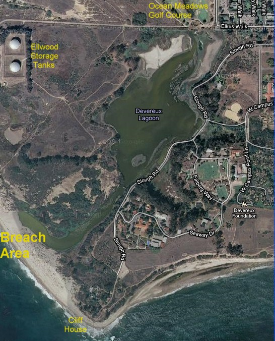
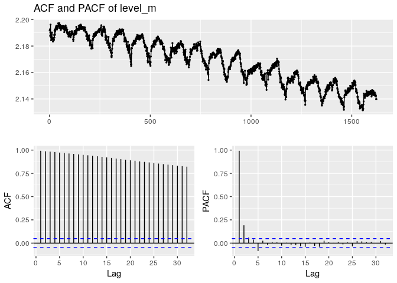

Devereux Slough Time Series
================
Christopher Chan
February 17, 2019

Introduction
============

Devereux Slough is a estuary in the Santa Barbara County. We developed Water Quality and Invertebrate Monitoring Program which collected samples from Devereux Slough. Water quality data was captured at regular intervals allowing us to build a time series model. This time series model can provide insights on how the estuary varies over time, while also predicting how the estuary might look in the future.

This project is broken down into the following steps:

1.  Background of Devereux Slough and data
2.  Normalizing the data
3.  Creating the model
4.  Validating the model
5.  Forecasting
6.  Conclusion

This model serves several purposes. First, allows the COPR staff to more informed management descisions about the reserve and Devereux Slough. Collecting data and building models should result in better management of the reserve. Second, it extends the power of the COPR staff, allowing volunteers to contribute in meaningful ways with minimal effort from the COPR staff. Third, it can contribute to the larger scientific understanding of ecology. There is little scientific literature on TOCE in North America, most of the literature reflects TOCE in South Africa.

This project outlines a small portion of the Water Quality and Invertebrate Monitoring Program carried out by the Santa Barbarba Audubon Society, Coal Oil Point Reserve (COPR) and the Cheadle Center for Biodiversity and Ecological Restoration. More information about the Santa Barbara Audubon Society can be found [here](https://santabarbaraaudubon.org/), as well as COPR which can be found [here](https://copr.nrs.ucsb.edu/).

1 Background
============

### Introducion to Devereux Slough

Devereux Slough is a temporary closed/open estuary (TOCE) off of the Santa Barbara Channel. It is located within the COPR, a University of California Natural Reserve and managed by the University of California, Santa Barbara (UCSB). Along with the slough, COPR also manages Sands Beach which sits just meters away from Devereux Slough. This is thought to be a major source of water for the estury, though this has changed with the connection of Devereux Slough to North Campus Open Space (NCOS).



A map of the Devereux Slough and the surrounding area

In general estuaries are 1 of the most productive aquatic systems in the world. Devereux Slough fits the definition of a temporary closed/open estuary. This means that for part of the year it is open to inputs of water and the rest of the year it is closed to inputs of water. Inputs of water in this context refers to bodies of watr and importantly exclude percipitation. For Devereux Slough it is closed for most of year, only open when it breaches during the winter, for a couple of days. This occurs when Devereux Slough fills up to a critical level from winter percipitation that water will flow over the sand berm and into Sands Beach, ultimately flowing into the Pacific Ocean. [Videos](https://www.youtube.com/watch?v=DVUcGfp0blE) of this event show just how violent flowing water can be.

A PhD thesis by Darcy Goodman examined Devereux Slough in a holistic sense, especially focussing on the fish diversity and management of the reserve. In addition to her thesis, Goodman estiblished a similar monitoring program, however that ended a couple years after starting. The lack of long-term ecological data is concerning on its own. However, with th recent major changes in the area, namely the connection of Devereux Slough to NCOS, monitoring Devereux Slough becomes more a of a pressing issue. We have already seen impacts to Devereux Slough from NCOS.

### Collection method

The Pier is one of three sites that we conducted consistently and is the deepest of all the sites, with consistent depths of over 1.5 meters. Data was collected via data loggers deployed off the Pier. The loggers recorded data every 15 minutes, which amounts to 96 data points per day. We retrieved the data and performed maintaince on the loggers every 2 weeks. This took roughly 2 hours, which explains some of the gaps in the data.

 A gorgeous picture of the Pier. Credits to the Santa Barbara Audubon Society

### Expected trends

Santa Barbara's climate is classified as a Mediterranean climate, characterized with warm, dry summers and mild winters. Little if any percipitation occurs outside of winter and annual percipitation is around 0.5 m per year. Because of this we can hypothesize some general water level trends. We would expect water level to be highest during the winters and decrease throughout the years, with the lowest points during the summer months, June through August.

``` r
library(tidyverse)
library(here)
library(zoo)
library(tseries)
library(forecast)
```

2 Normalizing the data
======================

Reading in a logger dataset that I've been using for testing.

``` r
here()
lv <- read_csv('data/180301 Level Data.csv')
```

Changing the format of the date\_time column into a readible format by time series functions. We are using the zoo() over other time series functions, like the standard ts(), because it works well with irregular intervals.

``` r
lv$date_time <- as.POSIXct(lv$date_time, format = '%m/%d/%y %H:%M')

lv_zoo <- zoo(lv$level_m, order.by = lv$date_time)
str(lv_zoo)
```

    ## 'zoo' series from 2018-02-12 12:00:00 to 2018-03-01 09:15:00
    ##   Data: num [1:1622] 2.19 2.19 2.19 2.19 2.2 ...
    ##   Index:  POSIXct[1:1622], format: "2018-02-12 12:00:00" "2018-02-12 12:15:00" ...

``` r
cat('\nAbsolute difference in water level over the period of', as.character(start(lv_zoo)), 'and', as.character(end(lv_zoo)), 'in meters:', max(lv_zoo) - min(lv_zoo))
```

    ## 
    ## Absolute difference in water level over the period of 2018-02-12 12:00:00 and 2018-03-01 09:15:00 in meters: 0.06599439

Graphing the water level across time we gather a number of important insights into our data. The first is that the time series is not stationary. A quick look at the graph and we can conclude that the mean decreases over time. Without further testing it is too hard to tell if the variance and covariance vary over time, but I believe they are relatively constant. If the variance is constant than we can perform additive decomposition, this is where the seasonal variation is constant across time. Second, it appears we have some seasonality, on a daily basis. This should be removed in order to get a accurate depiction of the trend of the series. These statitistical facts fit the ecological realities of Devereux Slough. Because of the very short rainy season, roughly 3 months, in Santa Barbara we would expect to see water level decrease in late winter.

``` r
df_lv_zoo <- data.frame(lv_zoo)

df_lv_zoo <- df_lv_zoo %>%
    rename(level = lv_zoo) %>%
    mutate(plot_time = as.POSIXct(rownames(df_lv_zoo), format = "%Y-%m-%d %H:%M:%S"))
df_lv_zoo <- df_lv_zoo %>% select(plot_time, level)

ggplot(df_lv_zoo, aes(plot_time, level)) +
    geom_line() +
    xlab('Date') +
    ylab('Level (m)') + 
    ggtitle('Water level (m) over time')
```


The same time series with a smoothing function to get the general trend.

``` r
ggplot(df_lv_zoo, aes(plot_time, level)) +
    geom_line() +
    geom_smooth(method = 'loess', se = FALSE) +
    xlab('Date') +
    ylab('Level (m)') + 
    ggtitle('Water level (m) over time w/ trend line')
```


ACF before differencing. There is a obvious pattern to our data and most of the lags are above the significance level.

``` r
ggAcf(lv$level_m, lag.max=100)
```



1.  EDA data
    -   Plot of data with loess
2.  Stationarity
    -   ACF & PACF
    -   ADF and KPSS test
3.  Parameters of model
    -   Analyze ACF & PACF model
4.  Create model
    -   Why i'm using this model
        -   Pros/Cons
5.  Validate model
6.  Forecast
7.  Conclusion
